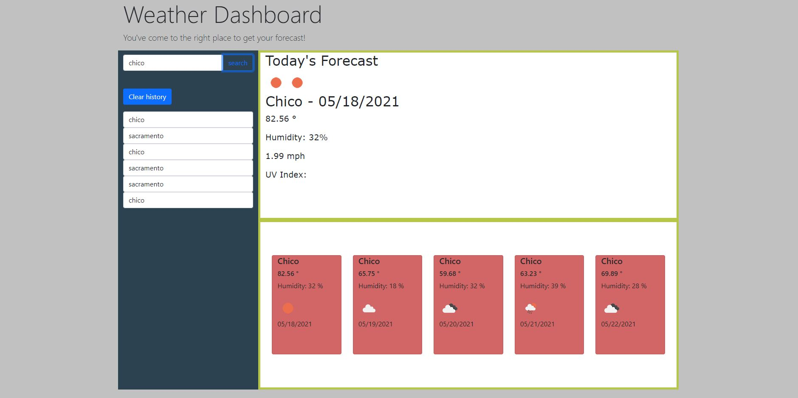

## MikesWeatherDashboard
This dashboard takes whatever city you put in and returns the current weather forecast along with a 5 day forecast. It was a really fun project to build. I had originally hard coded the cards for the 5 day forecaset but went back and challenged myself to dynamically create them with JS.

# Screenshot

# Link to deployed app

[Link to deployed webpage](https://michaelzadra27.github.io/MikesWeatherDashboard/)

# Technologies

HTML5, CSS3, JavaScript ES6+, jQuery

